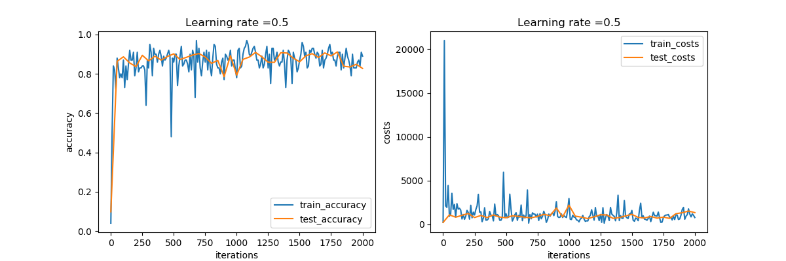

### 本仓库记录了学习 google 出品的 tensorflow_without_a_phd 之 tensorflow_mnist_tutorial 教程的过程

#### 版本

```
python 3.7.4
tensorflow 1.15.0
keras 2.3.1
opencv 4.3.0
```

PS：项目中用到了 datasets 和 models 等辅助资料不在仓库中备份。

