# 使用 tensorflow 训练 mnist 记录

数据集 mnist 是一系列手写数字的灰度图像集。包含 0-9 共十个数字的手写体。图像大小为 28 x 28 像素，其中，训练集包含 60000 张图像，测试集包含 10000 张图像。

### 环境

代码运行环境为 python 3.7.4，tensorflow 1.15.0，笔记本电脑 Win10 系统，pyCharm IDE。

## 目录

本文记录使用 tensorflow 训练 mnist 数据集的过程。参考 google 出品的 tensorflow-without-a-phd 教程。内容包括：

- [train1: 有 10 个单元的单层 softmax 网络](#train1: 有 10 个单元的单层 softmax 网络)
- [train2: 浅层网络](#train2: 浅层网络)
- [train3: 添加dropout的浅层网络](#train3: 添加dropout的浅层网络)
- [train4: 卷积网络](#train4: 卷积网络)
- [train5: 添加batchnorm的卷积网络](#train5: 添加batchnorm的卷积网络)

## train1: 有 10 个单元的单层 softmax 网络

仅有一层的 softmax 网络是最简单的网络，将输入图像平铺成一维向量，与 softmax 层的 10 个单元直连。一般取 minibatch 的大小为 100 ，则需要调整的超参数只有学习率 learning_rate 。

以下按照 learning_rate = [0.5, 0.05, 0.005] 进行训练，同时对比训练集和测试集的准确率和代价，如下所示：

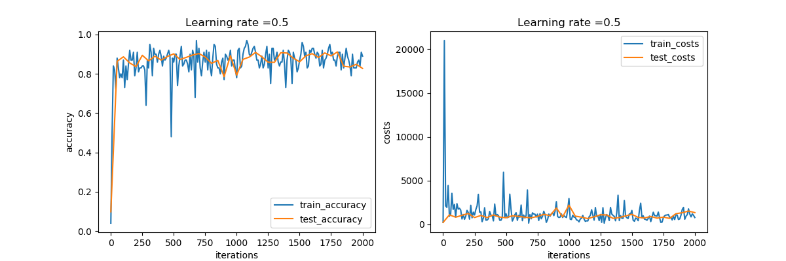


max test accuracy: 0.9115

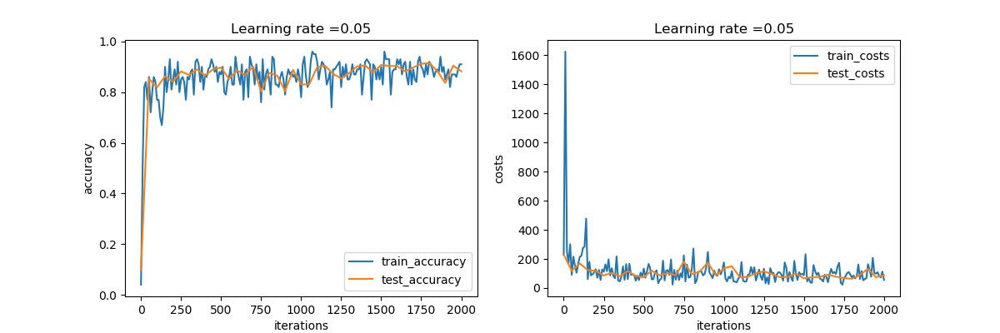

max test accuracy: 0.9151

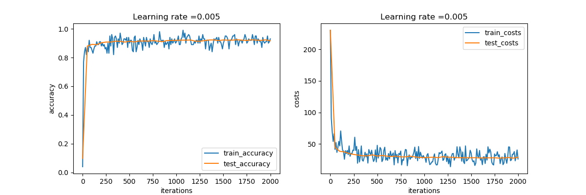

max test accuracy: 0.9236

可以看到学习率越大，曲线波动越大。仅用 softmax 网络在 2k 次迭代后就能达到 90% 以上的准确率。且 2k 次迭代基本能够达到稳定的准确率峰值。

参考代码：tensorflow_mnist_1.0_softmax.py

## train2: 浅层网络

第一步改进是用浅层神经网络替换单层 softmax 网络。网络层数和每层的单元数可以自定义。最后一层依旧是 softmax 层，有 10 个单元。

由于 sigmoid 激活函数的学习率比 ReLU 激活函数的学习率慢，在隐藏层中使用 ReLU 激活函数。

该网络中的超参数有学习率，网络层数，每层的单元数。

### 第一个网络

```
layers = [784, 200, 100, 60, 30, 10]
learning_rate=0.005
iterations=10000 + 1
sigmoid()
GradientDescentOptimizer
```

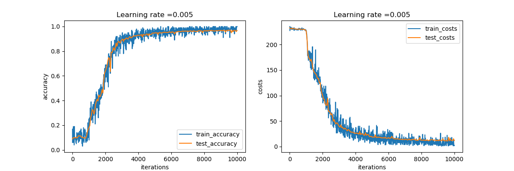

max test accuracy: 0.9706

```
layers = [784, 200, 100, 60, 30, 10]
learning_rate=0.005
iterations=10000 + 1
relu()
GradientDescentOptimizer
```

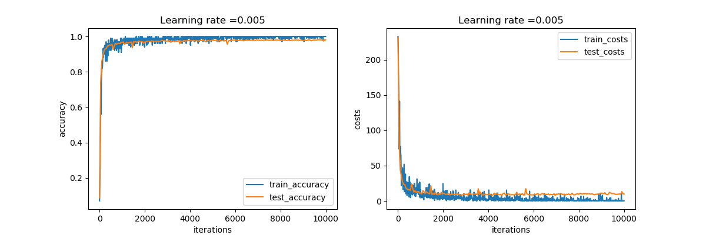

max test accuracy: 0.982

使用浅层神经网络的 ReLU 激活函数明显看出学习速度较慢，在 8k 次迭代左右才达到较稳定的准确度。总的准确度比单层 softmax 网络提高了 0.06 左右。

在网络层数和每层的单元数相同的条件下，在 sigmoid 激活函数同时使用 Adam 优化算法比使用梯度下降优化算法得到的代价曲线更加平滑，经过少量的迭代次数就能大幅度降低代价值。

### 第二个网络

```
layers = [784, 320, 160, 80, 40, 20, 10]
learning_rate=0.005
iterations=10000 + 1
GradientDescentOptimizer
```

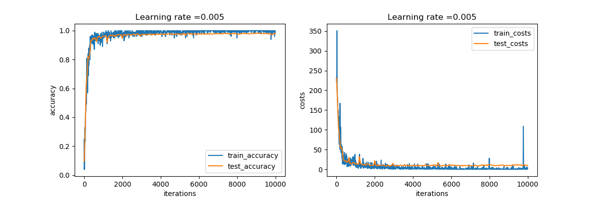

max test accuracy: 0.9827

再加深网络层数对提高训练的准确度的帮助不再明显，对该数据集来说，一个五层的网络已经能够达到较高的测试准确度了。网络越深训练时间也不断增加。

参考代码：tensorflow_mnist_2.0_five_layers_relu.py

## train3: 添加dropout的浅层网络

在 train2 中，虽然测试集的准确度在不断提高，但是与训练集对比发现两者的曲线发生了分离，意味着网络存在过拟合问题。接下来在网络中添加 dropout 来降低过拟合问题。

该网络中新增一个超参数，即决定每一层网络的 keep_prob 值。

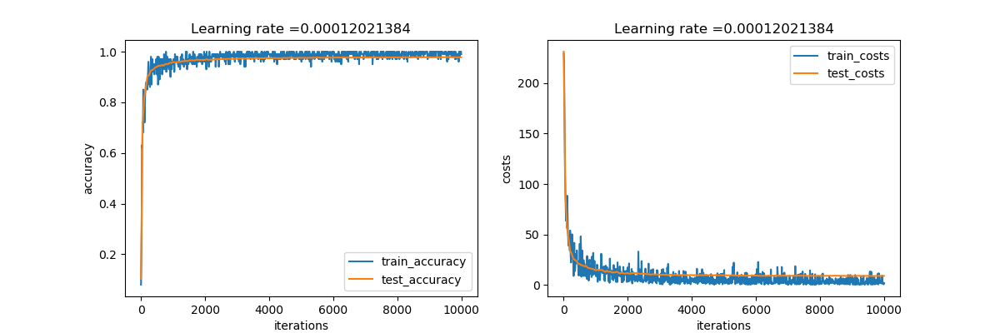

max test accuracy: 0.9786

测试后发现添加 dropout 后，即使调节了 keep_prob 的值，对过拟合的问题也没有明显的改善，反而使得最大测试准确度略有下降。也体现出神经网络调参的权衡问题。

参考代码：tensorflow_mnist_2.2_five_layers_relu_lrdecay_dropout.py

## train4: 卷积网络

密集网络由于参数很多，容易产生过拟合现象，如果在网络中添加 dropout 等方法也不能降低该问题，那么使用卷积网络能够大幅度减少参数的使用，在深层网络中表现比密集网络效果好很多。

设计的网络结构如下：

input-->CONV-->CONV-->CONV-->FC-->softmax

其中，卷积层数、滤波器的大小、stride 的尺寸、全连接层的数量等，都是可以修改的。

### 第一个网络

```
input:[batch, 28, 28, 1]
conv1:[5, 5, 1, 4] stride = 1
conv2:[5, 5, 4, 8] stride = 2
conv3:[4, 4, 8, 12] stride = 2
FC1:[7*7*12, 200]
softmax:[200, 10]
```

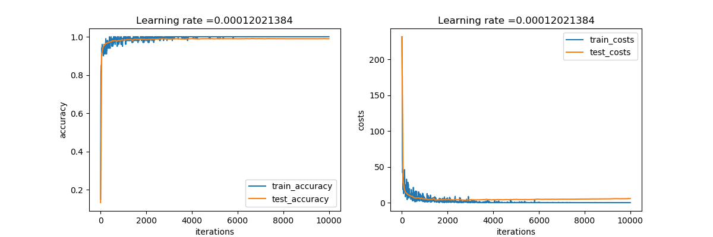

max test accuracy: 0.9906

卷积网络的曲线显示出平滑的性质，能够快速收敛到极值附近，并且最终的波动也很小。一个五层的卷积网络就能达到比浅层密集网络更好的准确度。

```
input:[batch, 28, 28, 1]
conv1:[5, 5, 1, 6] stride = 1
conv2:[4, 4, 4, 12] stride = 2
conv3:[4, 4, 8, 24] stride = 2
FC1:[7*7*12, 200]
softmax:[200, 10]
```

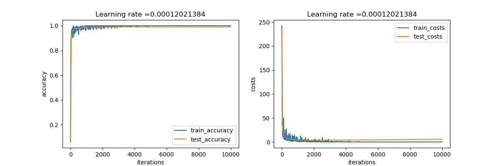

max test accuracy: 0.9915

调整网络的结构（增加通道数量、改变滤波器尺寸等）对提高准确率有一定的帮助。过拟合的问题仍然存在，两条曲线末端的分离依旧明显。

参考代码：tensorflow_mnist_3.0_five_layers_convolutional.py

### 第二个网络

在全连接层添加 dropout 后的效果如下：

```
input:[batch, 28, 28, 1]
conv1:[5, 5, 1, 6] stride = 1
conv2:[4, 4, 4, 12] stride = 2
conv3:[4, 4, 8, 24] stride = 2
FC1:[7*7*12, 200] keep_prob = 0.75
softmax:[200, 10]
```

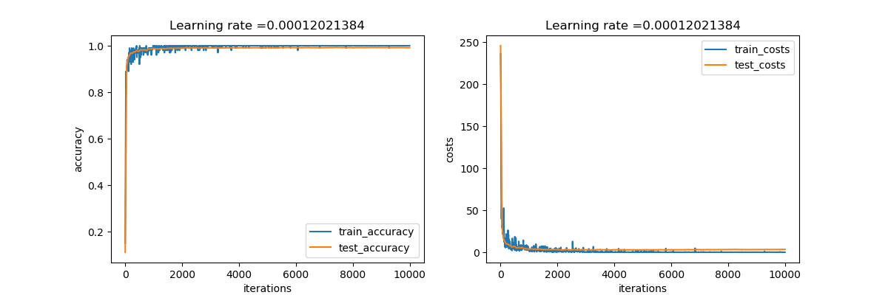

max test accuracy: 0.9929

添加 dropout 后网络的过拟合问题有部分改善。

参考代码：tensorflow_mnist_3.1_five_layers_convolutional_dropout.py

## train5: 添加batchnorm的卷积网络

在上述网络中添加 batchnorm ，位于线性计算和激活函数之间。添加 batchnorm 能够让每层网络的输入变得更加规范，让均值和方差不同的特征分布更加均衡，有利于网络的迭代收敛。

```
input:[batch, 28, 28, 1]
conv1:[5, 5, 1, 6] stride = 1 bn
conv2:[4, 4, 4, 12] stride = 2 bn
conv3:[4, 4, 8, 24] stride = 2 bn
FC1:[7*7*12, 200] bn keep_prob = 0.75
softmax:[200, 10]
```

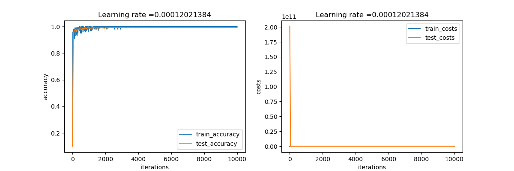

max test accuracy: 0.9932

在最终的网络中，使用了 batchnorm ，dropout ，learning_rate_decay ，ReLU 等一系列功能，目的是在提高准确率的同时降低过拟合，经过了较长时间的运行后，可以对比出最终的网络是处理过拟合效果最好的。

本次实践中仅进行了有限次数的运行，对超参数的调整也不够全面，上述内容代表了网络优化的大致方向。其中的个别阶段存在优化效果不明显的情况，如果能够进行更充分的验证则对其中的原因有更深的了解。

参考代码：tensorflow_mnist_3.2_five_layers_convolutional_bn.py

